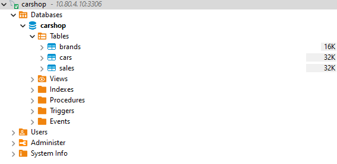
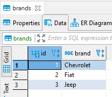
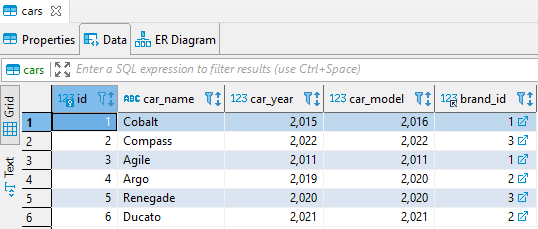
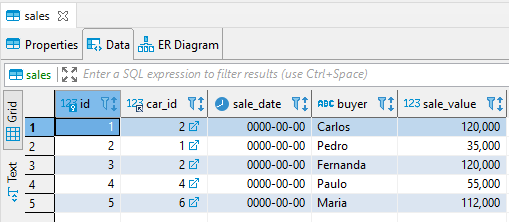

# Vagrant's activity

This repository is from an activity of the Software Engineering MBA .
Team: Gian Matheus and Estevão Fekete

## Installation

1 - Clone this repository. \
2 - Make sure you have [Virtual Box](https://www.virtualbox.org/wiki/Downloads) and [Vagrant](https://www.vagrantup.com/downloads) local installation \
3 - use "vagrant up" command

```bash
git clone https://github.com/GMatheusFP/infra-vagrant.git 
```

```bash
vagrant -v 
Vagrant 2.2.18 # Response example (if your bash not return something like this, please install Vagrant)
```

```bash
cd infra-vagrant
vagrant up
```

## How do I connect to the database?

In your Workbench or other DBMS, put the following configuration: \
Server Host: 10.80.4.10 \
Port: 3306 \
Database: carshop \
User: carshop \
Password: carshop 


## How is database?
Schema: \
 \
Brands Table: \
 \
Cars Table: \
 \
Sales Table: \
 \

